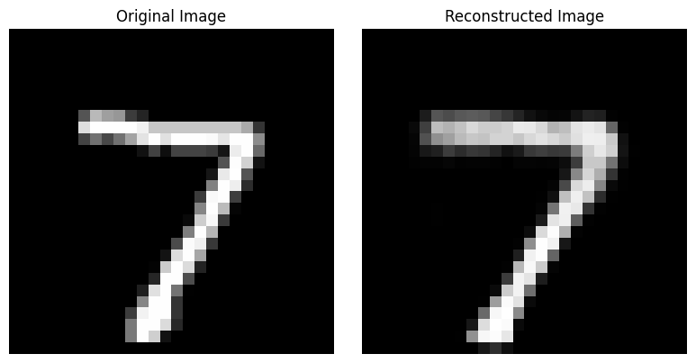
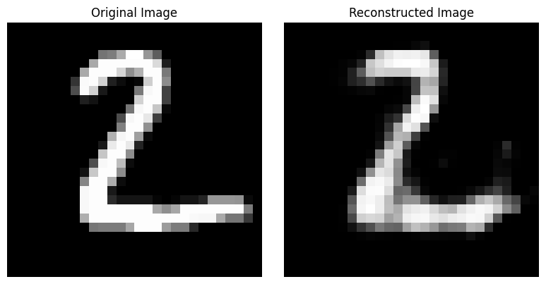
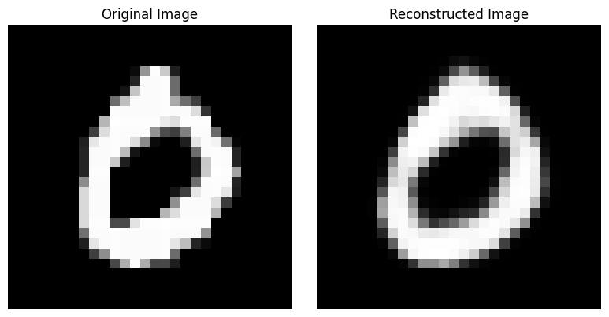

# Image Reconstruction with AutoEncoder

This project demonstrates image reconstruction using an AutoEncoder model on the MNIST dataset. The AutoEncoder compresses input images into a smaller latent space and then reconstructs the original image.

## Requirements

- Python 3.x
- PyTorch
- Matplotlib

## Model Architecture

The AutoEncoder model consists of two main parts: the **Encoder** and the **Decoder**.

### Encoder
The Encoder compresses the input image (28x28) into a lower-dimensional latent space, represented as a 32-dimensional vector.

-  **Flattening**: The input image (28x28 pixels) is flattened into a 784-length vector.
-  **Fully Connected Layers**:
    - 784 -> 128 neurons
    - 128 -> 64 neurons
    - 64 -> 32 neurons (Latent Space)

### Decoder
The Decoder reconstructs the original image from the latent space vector.

- **Fully Connected Layers**:
    - 32 -> 64 neurons
    - 64 -> 128 neurons
    - 128 -> 784 neurons
- **Reshaping**: The output of the final layer (784) is reshaped back into a 28x28 image to match the original input image's dimensions.

The AutoEncoder learns to map the input image to a compressed representation in the latent space and then reconstruct it back to its original form as closely as possible.

## Results

The model will reconstruct the input images after training. You should expect the reconstructed images to look similar to the original images, albeit with some loss of detail due to compression.

Example outputs:

#### Example of 7

#### Example of 2

#### Example of 0
